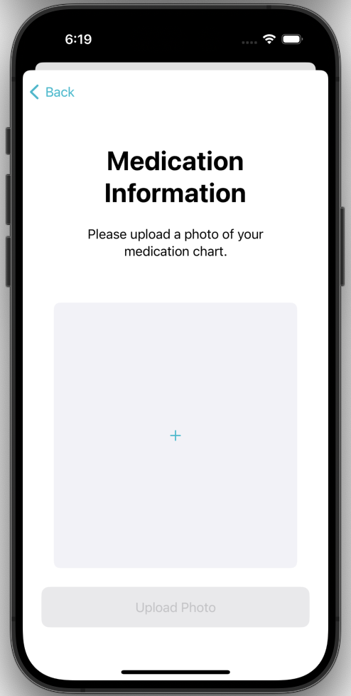
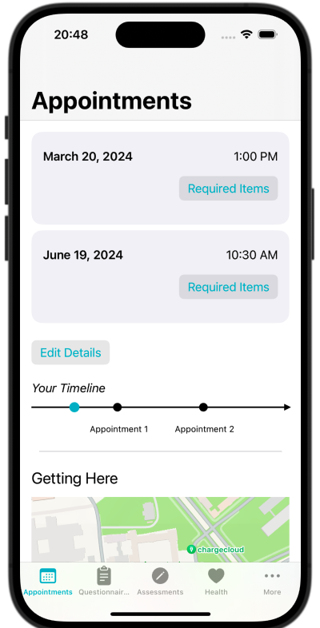
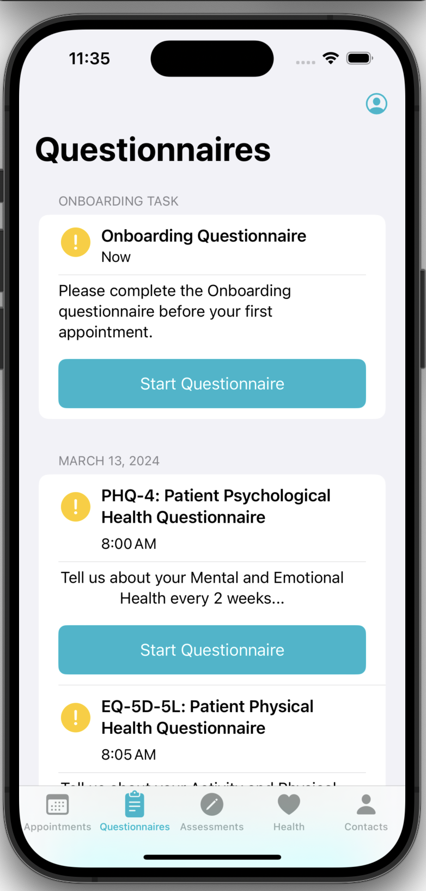
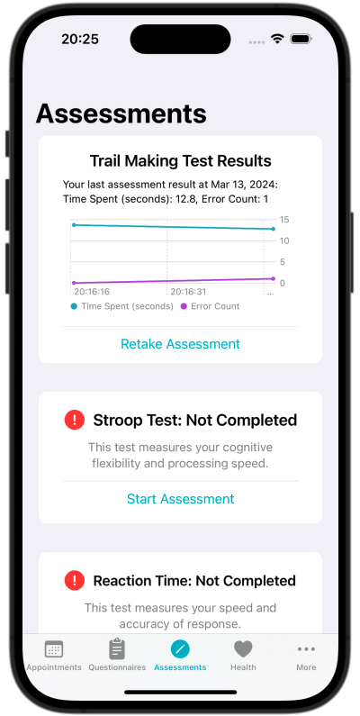
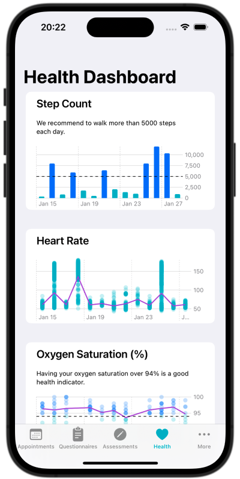
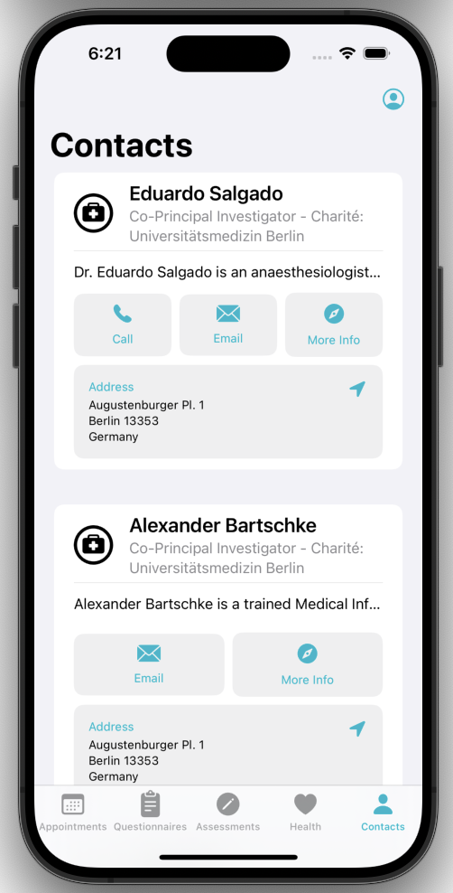

<!--

This source file is part of the PICS based on the Stanford Spezi Template Application project

SPDX-FileCopyrightText: 2024 Stanford University

SPDX-License-Identifier: MIT

-->

# CS342 2024 PICS

This repository contains the CS342 2024 PICS application.
This PICS for PCOS Patients application is using the [Spezi](https://github.com/StanfordSpezi/Spezi) ecosystem and builds on top of the [Stanford Spezi Template Application](https://github.com/StanfordSpezi/SpeziTemplateApplication).

> [!NOTE]  
> Do you want to try out the CS342 2024 PICS application? You can download it to your iOS device using [TestFlight](https://testflight.apple.com/join/oHPpBoKG)!

## Overview
The PICS application allows patients undergoing ovarian cyst removal surgery and its intensive care therapy post-surgery or sufering from PCOS to better track their recovery to inform their doctors on their health. Patients fill out necessary hospital questionnaire through the application prior to their hospital visit and track their health vitals based on their Apple health data, as well as plan and prepare for their appointments. 

## PICS for PCOS Patients Features
Our application first allows users to create an account to help keep track of their information which includes taking an onboarding questionnaire to collect their basic information, uploading a photo of their medication plan, and entering their appointment information during the onboarding process. Once users have created an account, there are five main features. 

1. Appointments: Users can view their appointment time and the required documents to bring for each of their appointments in the form of interactive checklists. Users can also edit the appointment times in this view, and corresponding notifications will be sent 1 month, 1 week, 3 days, 1 day, and 30 minutes earlier, as well as at the time of the appointment to remind users of their upcoming appointments. There is also a map with the address at the bottom of the view to visualize the location of the appointments to help users navigate.

2. Questionnaires: Users can take the 3 main questionnaires required for each appointment directly through this app on their phone, when they navigate to the Questionnaires tab. This page helps users attempt the questionnaires in a structured manner at specific 5-minute intervals every two weeks. The UI of each task changes according to the completion state: the questionnaire task shows an incomplete yellow exclamation symbol and supporting text suggestion if the questionnaires are incomplete, and a green check mark and appropriate text if the questionnaires are completed. Besides this, if the users choose to skip the onboarding questionnaire during the onboarding process, this onboarding questionnaire will also show up in this tab. Once each questionnaire is started, one question appears per screen, and selecting an option and pressing the bottom button allows you to navigate to the next question.

3. Assessments: Users can take assessments to measure their cognitive abilities. Our application includes the trail-making test, Stroop test, and reaction time test to measure different aspects of the user's cognitive skills. Results will be displayed as a chart and users can click on a dot to see more details about the selected result. Otherwise, our app will show the user's last test result for each test.

4. Health Vitals: Users can view their health vitals (step counts, oxygen saturation, and heart rate) in the previous two weeks. Related details will be shown when users click on a specific bar or dot in the chart for users to learn more about their health condition. Besides, thresholds are set and shown as horizontal lines for step counts and oxygen saturation to facilitate users' understanding of their health vitals.

5. Contacts: This page shows the contact information for the medical team and address information. The PICS app will direct users to the Apple Map for easier direction and navigation when users click on the address.

|<picture><source media="(prefers-color-scheme: dark)" srcset="Resources/MedicationView~dark.png"></picture>|<picture><source media="(prefers-color-scheme: dark)" srcset="Resources/AppointmentView~dark.png"></picture>|<picture><source media="(prefers-color-scheme: dark)" srcset="Resources/QuestionnaireView~dark.png"></picture>|
|:--:|:--:|:--:|
|`Medication View`|`Appointments View`|`Questionniare View`|

|<picture><source media="(prefers-color-scheme: dark)" srcset="Resources/AssessmentView~dark.png"></picture>|<picture><source media="(prefers-color-scheme: dark)" srcset="Resources/HealthDashboardView~dark.png"></picture>|<picture><source media="(prefers-color-scheme: dark)" srcset="Resources/ContactsView~dark.png"></picture>|
|:--:|:--:|:--:|
|`Assessments View`|`Health Vitals View`|`Contacts View`|

## Setup
1. See setup [instructions](https://spezi.health/SpeziTemplateApplication/documentation/templateapplication/setup/) for Spezi Application

## License

This project is licensed under the MIT License. See [Licenses](LICENSES) for more information.
